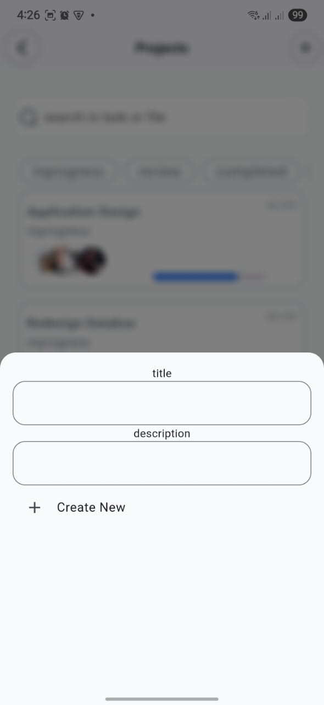

## Project Flow

 is a powerful and intuitive **Flutter-based mobile application** designed to empower individuals and teams to manage their projects efficiently and professionally. The app offers a comprehensive environment that helps organize workflows, effectively distribute tasks, and track progress on every project from start to finish, right from your mobile device.

While currently focused on delivering a seamless mobile experience across Android and iOS, the project is built with future development in mind, including potential support for the web platform.
## Key Features

* **Create Multiple Projects:** Easily start your projects and customize them to fit your needs.
* **Project Structuring:** Break down projects into key stages and organized sub-tasks.
* **Team Management:** Build a team for your project and invite members to join.
* **Task Assignment:** Clearly assign tasks to specific team members with defined due dates and priorities.
* **Progress Tracking:** Monitor the progress of tasks and stages at a glance, and see the status of each task (in progress, completed, overdue, etc.).
* **Simple User Interface:** Clear and easy-to-use design ensures a pleasant and productive experience on mobile.

---
## 🎥 App Preview

## 📱 Screenshots
## Discover Flow

| Splash                                  | Discover                                    | Onboarding 1                                      | Onboarding 2                                      | Onboarding 3                                      |
| :-------------------------------------- | :------------------------------------------ | :---------------------------------------------- | :---------------------------------------------- | :---------------------------------------------- |
|  |  |  |  |  |

## Application Screens

| Authentication          | Main Views                      | Project Management          | Utility & Settings        |
| :---------------------- | :------------------------------ | :-------------------------- | :------------------------ |
| Login                   | Home View                       | Project Details             | Alert Dialog              |
| Sign Up                 | Home View (Shimmer)             | Project View                | Setting View              |
|                         | Home View (Dark Mode)           | Create New Project          | Language View             |
|                         |                                 |                             | Change Language           |
|                         |                                 |                             | About View                |
|  |  |  |  |
|  |  |  |  |
|                         |  |  |  |
|                         |                                 |                             |  |
|                         |                                 |                             |  |

## Dark Mode Toggle

| Dark Mode Toggle |
| :--------------- |
|  |

## 🎨 Figma UI Design

Reference the official design file below:

🔗 [Figma Design](#)  
_(https://www.figma.com/design/8CO4zhd59yzN0ucV267SWf/Taskcy---Task-Tracker-App--Community-?node-id=2-79642&t=Aj63IzmfBN0nHgZB-0)_

---
