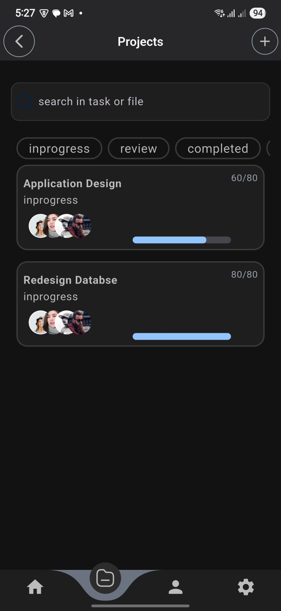

## Project Flow

 is a powerful and intuitive **Flutter-based mobile application** designed to empower individuals and teams to manage their projects efficiently and professionally. The app offers a comprehensive environment that helps organize workflows, effectively distribute tasks, and track progress on every project from start to finish, right from your mobile device.

While currently focused on delivering a seamless mobile experience across Android and iOS, the project is built with future development in mind, including potential support for the web platform.
## Key Features

* **Create Multiple Projects:** Easily start your projects and customize them to fit your needs.
* **Project Structuring:** Break down projects into key stages and organized sub-tasks.
* **Team Management:** Build a team for your project and invite members to join.
* **Task Assignment:** Clearly assign tasks to specific team members with defined due dates and priorities.
* **Progress Tracking:** Monitor the progress of tasks and stages at a glance, and see the status of each task (in progress, completed, overdue, etc.).
* **Simple User Interface:** Clear and easy-to-use design ensures a pleasant and productive experience on mobile.

---
## 🎥 App Preview


## 📱 Screenshots
## Discover Flow

| Splash                                  | Discover                                    | Onboarding 1                                      | Onboarding 2                                      | Onboarding 3                                      |
| :-------------------------------------- | :------------------------------------------ | :---------------------------------------------- | :---------------------------------------------- | :---------------------------------------------- |
|  |  |  |  |  |

## Application Screens

| Authentication          | Main Views          | Project Management          | Utility & Settings        |
| :---------------------- | :------------------ | :-------------------------- | :------------------------ |
| Login                   | Home View           | Project Details             | Alert Dialog              |
| Sign Up                 | Home View (Shimmer) | Project View                | Setting View              |
|                         |                     | Create New Project          | Language View             |
|                         |                     |                             | Change Language           |
|                         |                     |                             | About View                |
|  |  |  |  |
|  |  |  |  |
|                         |                     |  |  |
|                         |                     |                             |  |
|                         |                     |                             |  |

## Dark Mode Features

| Dark Mode Toggle        | Home View (Dark Mode)           | Profile (Dark)                | Project (Dark)                |
| :---------------------- | :------------------------------ | :---------------------------- | :---------------------------- |
|  |  |  |  |

## 🎨 Figma UI Design

Reference the official design file below:

🔗 [Figma Design](#)  
_(https://www.figma.com/design/8CO4zhd59yzN0ucV267SWf/Taskcy---Task-Tracker-App--Community-?node-id=2-79642&t=Aj63IzmfBN0nHgZB-0)_

---
## Features

- **Architectural Pattern:** MVC (Model-View-Controller)
- **Code Efficiency:** Reusable Components

### 1️⃣ Bottom Navigation Bar

- **Core Tabs:** Discover, Library, Profile
- **Navigation:** Smooth animated transitions using `PageRouteBuilder`
- **Visual Feedback:** Active tab visually highlighted

### 2️⃣ Shimmer Effect (Loading UI)

- **Placeholders for:**
  - Podcast Thumbnails
  - User Profile Avatar
- **Package:** Utilizes `shimmer` package (`^3.0.0`) for enhanced perceived performance

### 3️⃣ Dialogs and Bottom Sheets

- **Logout Confirmation:** `AlertDialog` with clean UI
- **Consistent Styling:** Unified UI styling across dialogs and bottom sheets

### 4️⃣ Authentication

- **User Login:** Secure user authentication flow
- **User Sign-Up:** Intuitive user registration process
- **State Management:** Implementation for managing authentication state

### 5️⃣ Language Management

- **Language Selection:** Option for users to choose their preferred language
- **Localization:** Implementation using `flutter_localizations` and `intl` for supporting multiple languages
- **Dynamic Updates:** App UI updates dynamically upon language change

### 6️⃣ Theme Management

- **Light Mode:** Default clean and bright user interface
- **Dark Mode:** Alternative darker theme for user preference and reduced eye strain in low-light environments
- **Theme Switching:** Seamless transition between light and dark modes
- **Persistence:** Remembering the user's preferred theme across app sessions
## Packages Used

This project leverages the following Flutter packages to enhance its functionality and user experience:

- **percent_indicator:** (`^version`) - For displaying progress in a visually appealing circular or linear format.
- **intl:** (`^version`) - Provides internationalization and localization facilities, including date/time, number, and message formatting.
- **easy_localization:** (`^version`) - Simplifies the process of adding and managing translations for multiple languages within the Flutter app.
- **flutter_blurhash:** (`^version`) - Used to display a blurred placeholder image while the actual image is loading, improving perceived loading times.
- **pie_chart:** (`^version`) - Enables the creation of interactive and customizable pie charts for data visualization.
- **shimmer:** (`^version`) - Implements a shimmering effect as a visual placeholder during loading states, enhancing the user's perception of performance.

**Note:** Please replace `^version` with the actual versions of these packages used in your `pubspec.yaml` file. For example:

```markdown
## Packages Used

This project leverages the following Flutter packages to enhance its functionality and user experience:

- **percent_indicator:** (`^4.2.3`) - For displaying progress in a visually appealing circular or linear format.
- **intl:** (`^0.19.0`) - Provides internationalization and localization facilities, including date/time, number, and message formatting.
- **easy_localization:** (`^3.2.0`) - Simplifies the process of adding and managing translations for multiple languages within the Flutter app.
- **flutter_blurhash:** (`^2.0.1`) - Used to display a blurred placeholder image while the actual image is loading, improving perceived loading times.
- **pie_chart:** (`^5.4.0`) - Enables the creation of interactive and customizable pie charts for data visualization.
- **shimmer:** (`^3.0.0`) - Implements a shimmering effect as a visual placeholder during loading states, enhancing the user's perception of performance.