## Project Flow

 is a powerful and intuitive **Flutter-based mobile application** designed to empower individuals and teams to manage their projects efficiently and professionally. The app offers a comprehensive environment that helps organize workflows, effectively distribute tasks, and track progress on every project from start to finish, right from your mobile device.

While currently focused on delivering a seamless mobile experience across Android and iOS, the project is built with future development in mind, including potential support for the web platform.
## Key Features

* **Create Multiple Projects:** Easily start your projects and customize them to fit your needs.
* **Project Structuring:** Break down projects into key stages and organized sub-tasks.
* **Team Management:** Build a team for your project and invite members to join.
* **Task Assignment:** Clearly assign tasks to specific team members with defined due dates and priorities.
* **Progress Tracking:** Monitor the progress of tasks and stages at a glance, and see the status of each task (in progress, completed, overdue, etc.).
* **Simple User Interface:** Clear and easy-to-use design ensures a pleasant and productive experience on mobile.

---
## 🎥 App Preview

## 📱 Screenshots

##Discover
| splash                                  | Discover                                    | onbording1                                      | onbording2                                      | onbording3                                      |
| :-------------------------------------- | :------------------------------------------ | :---------------------------------------------- | :---------------------------------------------- | :---------------------------------------------- |
| 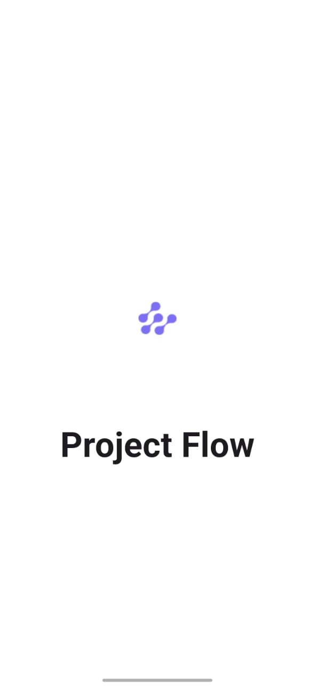         | 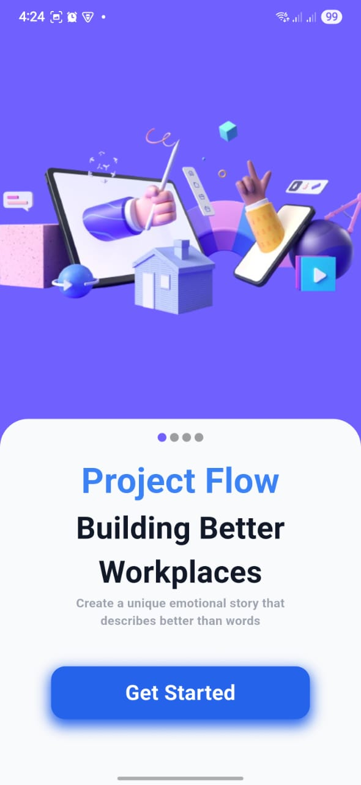          | 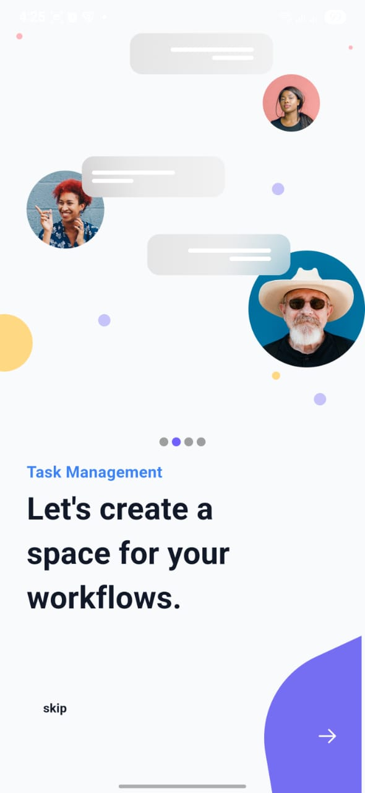        |         |         |

## application

| login                                   | sign_up                                     | home_view                                     | home_view_shimmer                             | project_details                                 | project_view                                  | create_new_project                            | AlertDialog                                   | setting_view                                  | darkmode                                    | home_view_dar_kmode                           | langauge_view                                 | change_langauge                               | about_view                                    |
| :-------------------------------------- | :------------------------------------------ | :-------------------------------------------- | :-------------------------------------------- | :---------------------------------------------- | :-------------------------------------------- | :---------------------------------------------- | :-------------------------------------------- | :-------------------------------------------- | :------------------------------------------ | :-------------------------------------------- | :---------------------------------------------- | :---------------------------------------------- | :-------------------------------------------- |
| 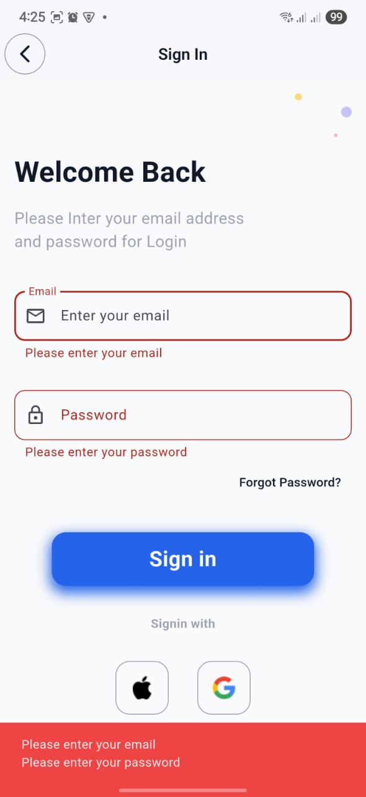          |            |          | 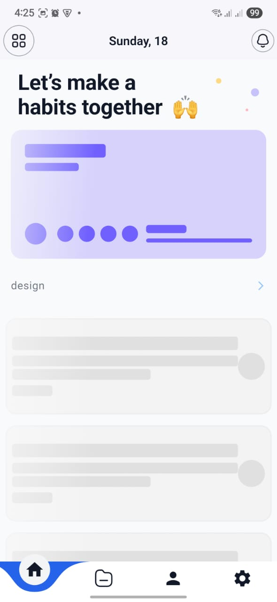 | 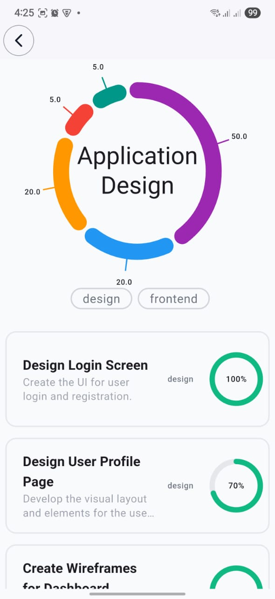 | 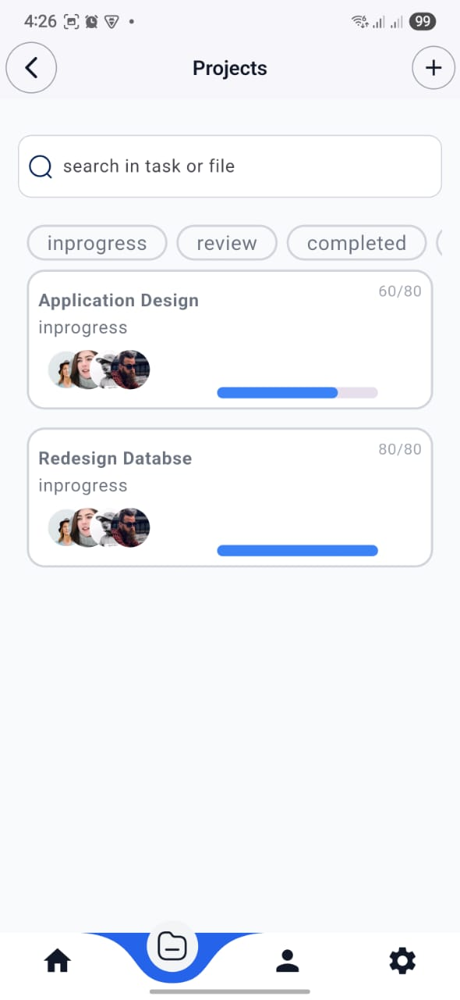   |  | 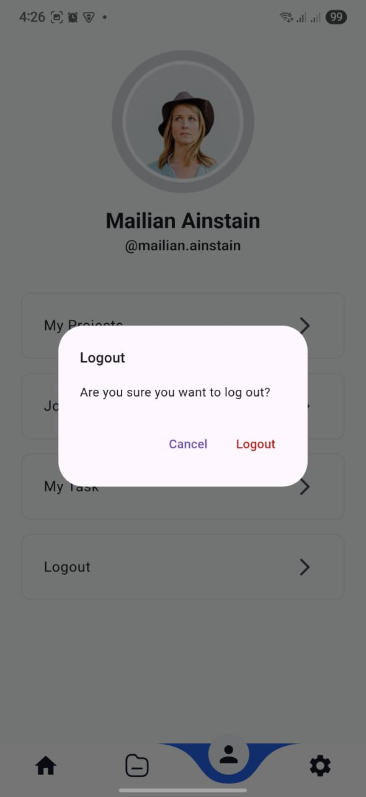   | 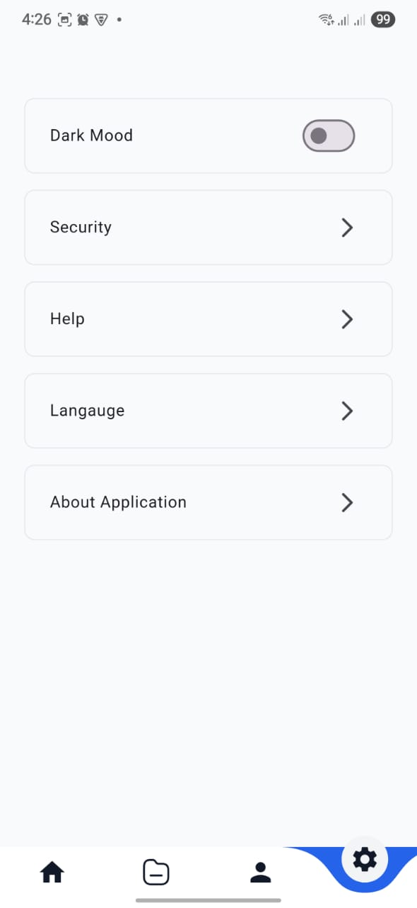   | 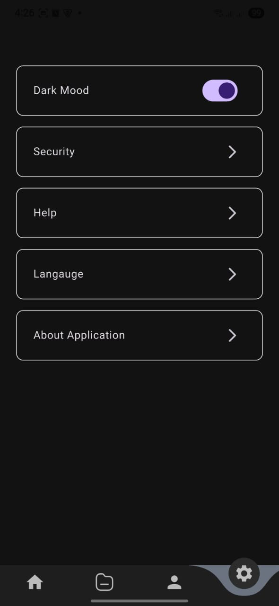           | 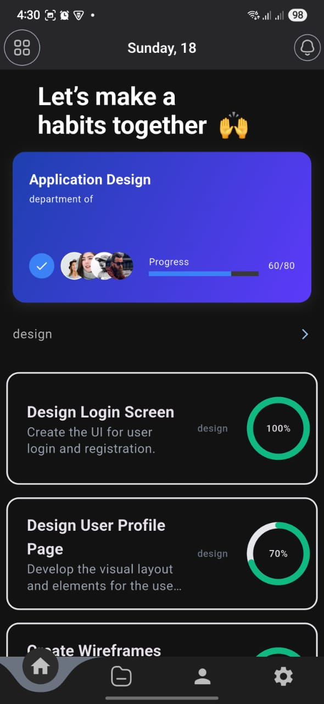 | 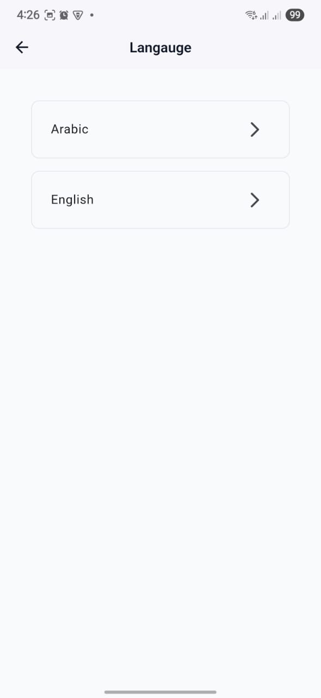 | 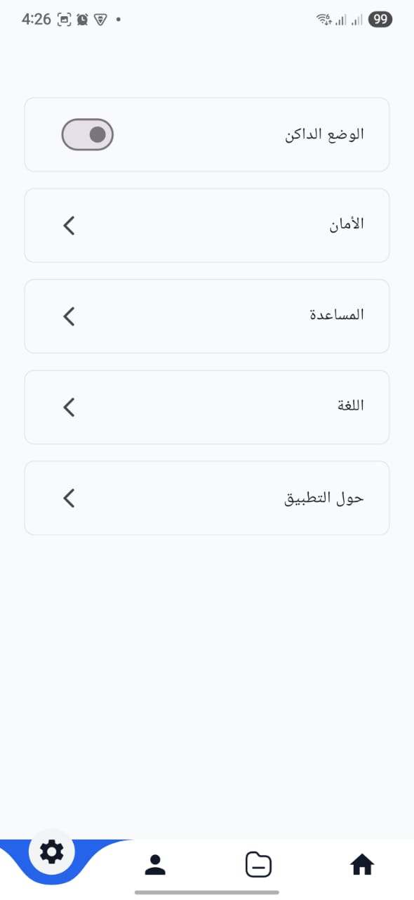 | 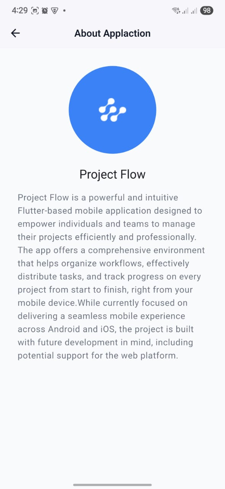       |
---

## 🎨 Figma UI Design

Reference the official design file below:

🔗 [Figma Design](#)  
_(https://www.figma.com/design/8CO4zhd59yzN0ucV267SWf/Taskcy---Task-Tracker-App--Community-?node-id=2-79642&t=Aj63IzmfBN0nHgZB-0)_

---
