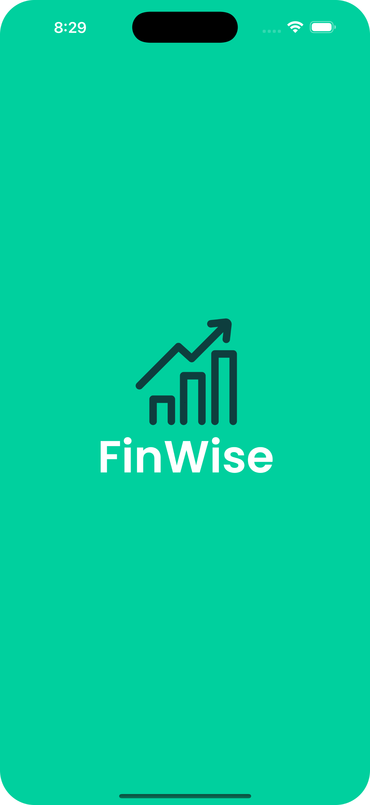
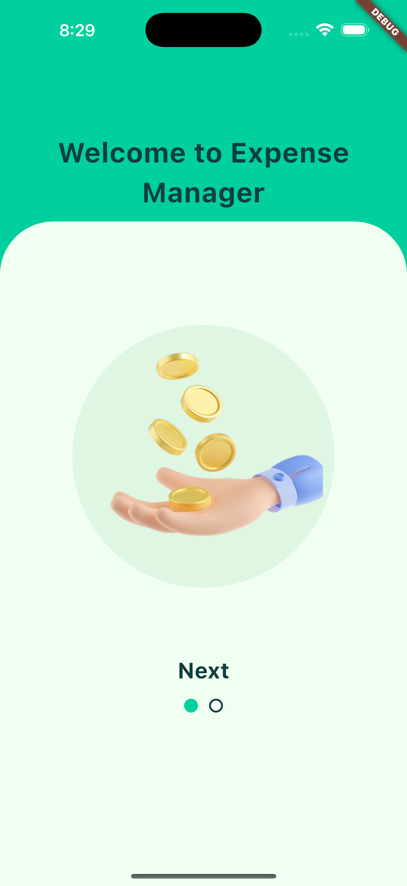
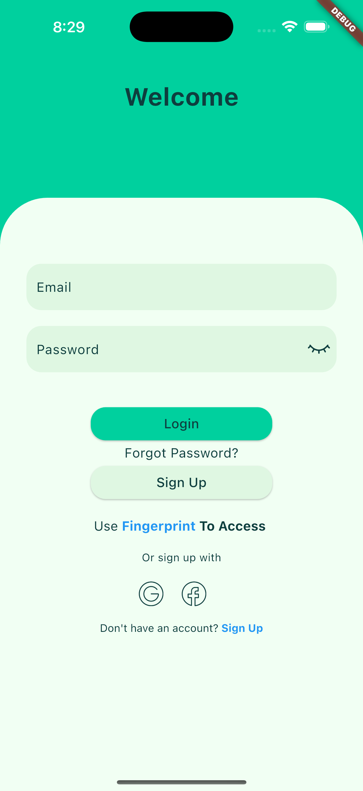
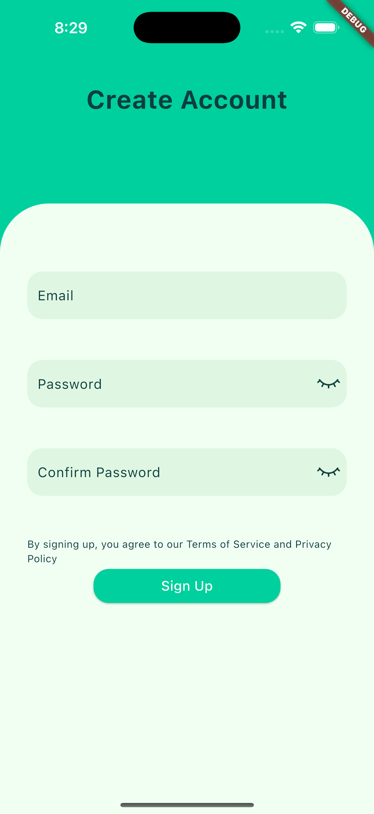
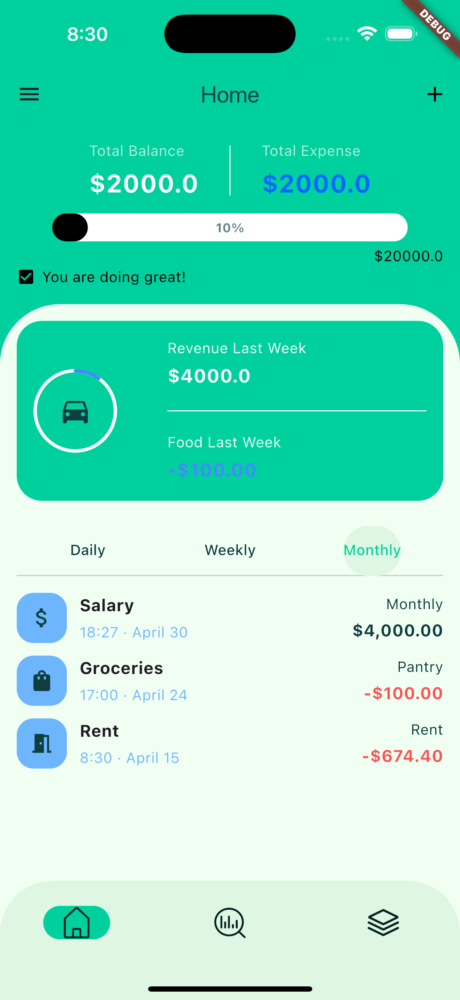
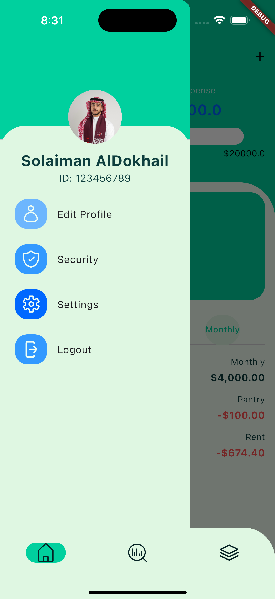
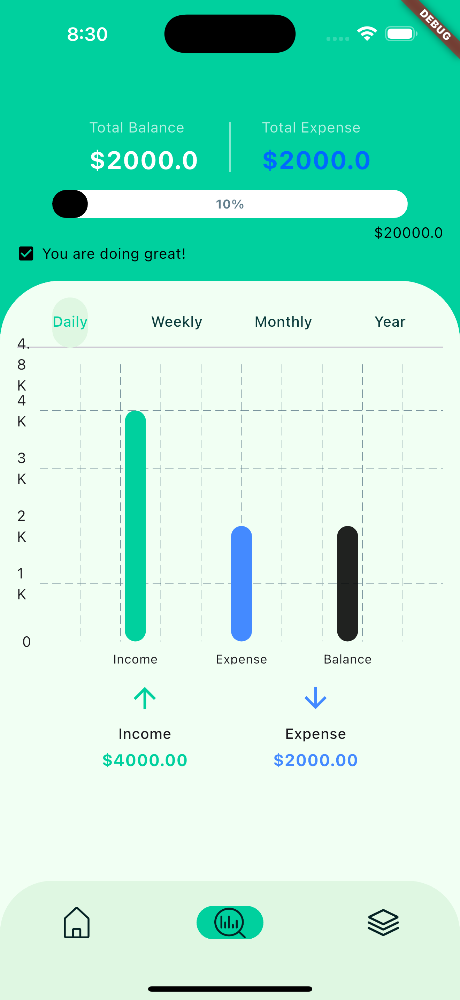
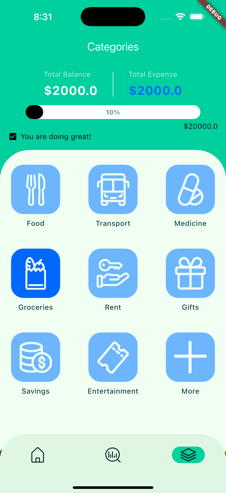

# Fintech Wise App UI

A sleek Flutter-based fintech app UI featuring a smooth onboarding experience, robust authentication with biometric support, and a modern Material Design 3 navigation structure tailored for personal finance management.

## Screenshots

### Splash Screen  


### Onboarding Screen  


### Authentication Screens  
  


### Home Screen  


### Drawer/Profile Screen 


### Analysis Screen  


### Categories Screen  


## Features
- **Splash Screen**  
  - A native splash screen that not only looks clean but its efficient.

- **Onboarding Flow**  
  - Visually engaging welcome screens with swipeable panels to introduce key app features and benefits.

- **Authentication with Validation & Biometrics**  
  - Tab-based Login and Signup forms with real-time validation for email and password inputs.  
  - Fingerprint (biometric) access: if fingerprint authentication fails, a Snackbar notifies the user of the invalid scan.

- **Alert & Snackbar Feedback**  
  - AlertDialog prompts for invalid email or password submissions.  
  - Snackbar alerts for biometric authentication errors.

- **Material Design 3 NavigationBar**  
  - Bottom navigation bar with three primary tabs: Home, Analysis, and Categories.

- **Custom Drawer**  
  - Unique left-side drawer design offering quick access to Profile and Logout options.

- **Home Screen**  
  - Balance header with sleek linear progress indicator showing spending vs. savings.  
  - FloatingActionButton to add income or expense via a modal bottom sheet with form validation and AlertDialogs.

- **Analysis Screen**  
  - Interactive bar chart comparing total income vs. expenses and displaying current balance.

- **Categories Screen**  
  - Balance header repeated for context.  
  - List of transaction categories (e.g., Food, Transport, Utilities) to filter and view category-specific spending.

## Tech Stack

- **Flutter** (>=3.0.0)  
- **Dart**  
- **Material Design 3** Components  
- **native_flutter_splash** for the splash screen
- **local_auth** package for biometric support  
- **fl_charts** for data visualization
- **percent_indicator** for the progress indicators

## Installation

1. Clone the repository:  
   ```bash
   git clone https://github.com/your-username/fintech-wise.git
   ```
2. Navigate to the project directory:  
   ```bash
   cd fintech-wise
   ```
3. Install dependencies:  
   ```bash
   flutter pub get
   ```
4. Run the app:  
   ```bash
   flutter run
   ```

## How to Use

- **Onboarding**: Swipe through the onboarding panels to learn about Fintech Wise’s features.  
- **Authentication**: Switch between Login and Signup tabs. Use fingerprint authentication if enabled.  
- **Navigation**: Tap the bottom navigation bar to switch between Home, Analysis, and Categories.  
- **Adding Transactions**: On the Home screen, tap the "+" button to add an income or expense. Fill out the form and submit.  
- **Viewing Insights**: Go to the Analysis tab to see income vs. expenses visualized.  
- **Managing Categories**: In the Categories tab, review and select transaction categories.  
- **Profile & Logout**: Open the drawer to view your profile or log out of the app.

## Author

*Solaiman Al-Dokhail*
