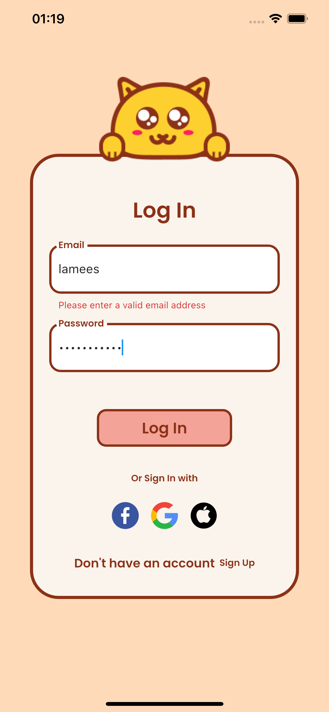
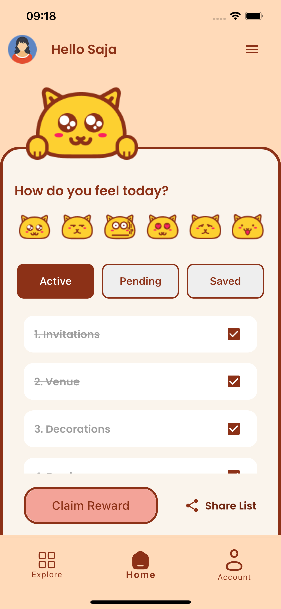
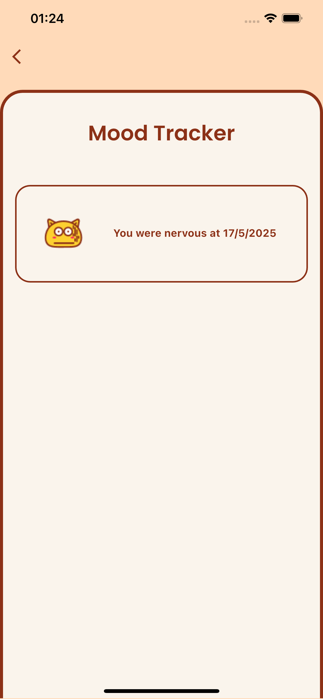

## Welcome to Taskins 🌱

An app designed to help you destress by tracking your mood and breaking down your to-dos with the power of AI, making life a little less stressful. 💫

##

## Screenshots and Media

| Splash Screen | Sign In | Shimmer Effect | Login Screen |
| -------------- | ------- | -------------- | ------------ |
|  |  |  |  |

---

| Home | Input Broad List | Input Result | Home Crossed |
| ---- | ---------------- | ------------ | ------------ |
|  |  |  |  |

---

| Home | Alert Dialog | Mood Tracker |
| ---- | ------------ | ------------ |
|  |  |  |

---

| Home | Home Arabic |
| ---- | ----------- |
|  |  |

---

| Profile Light | Profile Dark |
| ------------- | ------------- |
|  |  |

---

| Home | Bottom Sheet | Drawer |
| ---- | ------------ | ------ |
|  |  |  |

---

| Celebration Video | Change Language Video |
| ----------------- | --------------------- |
|  |  |

## Features ✨
1. Mood Tracking: Keep track of your mood with a simple, user-friendly interface.
2. AI-Powered To-Do Breakdown: Automatically break down broad tasks into manageable subtasks.
3. Personalization: Supports themes, localization, and customizable task lists for a personalized experience.

## Widgets Used 🛠️
Taskins uses the following Flutter widgets and components:
1. Drawer
2. Alert Dialog
3. Text Field
4. Navigation between Views
5. Bottom Navigation Bar
6. Bottom Sheet
7. Tab Bar View and Tab Bar
8. Page View
9. Themes
10. Phone Validation
11. Localization

##  Running the App 🚀
To run the app locally:
1. Clone the Repository:
git clone https://github.com/your-username/taskins.git
cd taskins
2. Install Dependencies:
3. flutter pub get
4. Run the App:
5. flutter run

## Extensions 📦
1. confetti - For celebratory animations
2. openai - For AI-powered task breakdown
3. shimmer - For sleek loading effects

## Figma Inspiration Links 🎨
https://www.figma.com/design/Rt0UsLBhGeYrGbvA8Krzj1/P4-G8-Wellness-%7C-Design-File---Your-Names-Here?m=auto&t=K79wDtz2bFUPC7b0-6

## Author 💻
By Lamees AL-Amri

 
