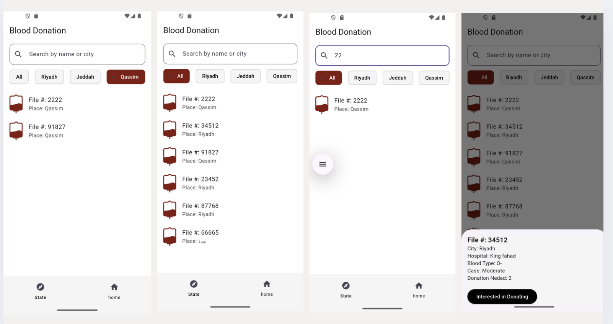

# Blood Donation App

A Flutter mobile application that allows users to either **donate blood** or **request blood donation**. The app includes advanced features such as search, filtering, multilingual support, and local data storage.

---

## Features

- User type selection: **Donor** or **Recipient**
- Login screen with:
  - `Form` widget and field validation using `validator`
- Multilingual support: English & Arabic via `easy_localization`
- Local data storage using `SharedPreferences`
- Loading animation using `Shimmer` effect
- Contextual feedback using `SnackBar` when form fields are not filled

---

## User Roles

### 1. **Blood Donor**
- Sees a list of donation requests.
- Can:
  - Filter requests by **city**
  - Search by **file number** using a `SearchBar`
  - Tap any request to open a **BottomSheet** with details
  - Press **"Interested in Donating"** → shows an `AlertDialog` confirming registration

### 2. **Recipient / Blood Requester**
- Can:
  - **Add a blood request** via a form
    - If any required field is empty, a `SnackBar` shows a message:  
      _"Please fill in all required fields"_
  - **View submitted requests**
  - **Delete requests**
  - Switch languages

---

## Screens

- `ChooseUserTypeScreen` – Select between donor or recipient
- `LoginScreen` – Uses `Form` + `validator` for login
- `DonorVolunteerScreen` – Donor sees available donation cases, with search/filter
- `RequestDonor` – Recipient views/deletes their requests
- `AskDonorHomeScreen` – Add a new donation request
- `Profile` – Change language and view basic info

---

## Packages Used

- `easy_localization` – for multilingual support
- `shared_preferences` – for storing data locally
- `shimmer` – for loading placeholder effects
- `flutter/material.dart` – UI components and layout

---

## Screenshots





## Setup

```bash
flutter pub get
flutter run
