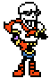
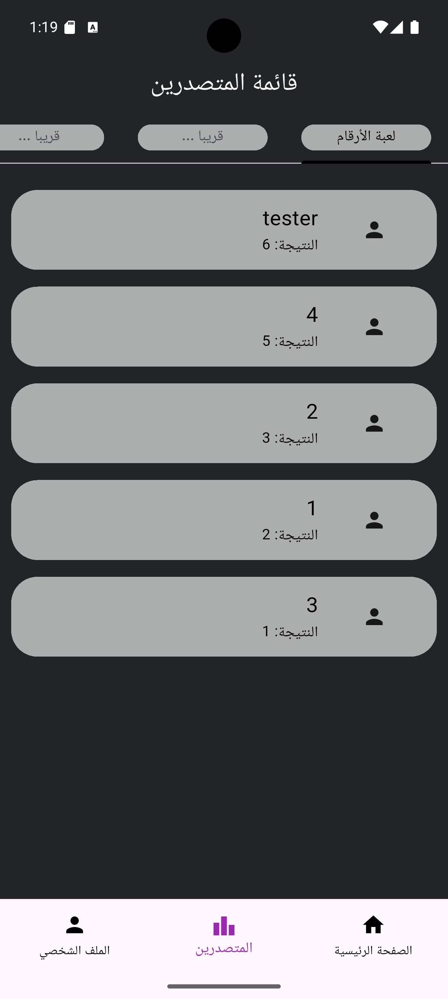
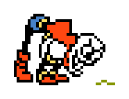
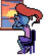

#  Brainies 🧠🧠



Today is the day that I make a game app that contains mini games
Today I present to you Brainies an app will test your brain, focus, and How many punches your screen can take.

Brainies focuses on brain games 🧠🎮, it will sharp your focus and enhance it the app now contains 1 mini game and will contain more in the future


---


Leaderboard sort score for each played game. 


---

## 📱 Features


- 🌐 **Support Arabic !!!** – شفت كيف يمديك تقرأ النص هذا, التطبيق فيه نفس الشي
- 😌 **Great design** – Simplicity sometimes isn't bad perfect UI for an app game ease to your eyes .
- 🖥️ **Interactive UI** – There is an eye watching you but it will close when you enter your password but it will get curious if you revealed your password.
- 🎮 **Minigames** – Mini games will squeeze every drop in your brain to sharpen it and will make your eyes wide open and foucsed.


- 🖼️ **Profile screen** – Now it's time to show the world the beauty of your cats it's you opportunity to show the wolrd your cat with profile screen feature 🐱.
- 🥇 **Leaderboard** – Leaderboard to show the other player who is the boss in the mini games it will show your score and name in each game you played and it will be sorted by the best player on the top which is you champ to the least score and that's me because I putted all my effort to build this project 😎. 
- 📱 **Splash Screen** – A masterpiece as always that will delight your day with it.

- 🗄️ **A Drawer** – For quick access if you drained all your effort into the mini games.

---

## 📦 Packages

 [Font Awesome Icon](https://pub.dev/packages/font_awesome_flutter)<br>
 [Easy Localization](https://pub.dev/packages/easy_localization)<br>
 [Shimmer](https://pub.dev/packages/shimmer)


---
---
##  Widgets 🐇🥪

- GamesShimmer: gives a shimmer for HomeContainers games<br>
- HomeContainers: to display games that are will be realesed soon or avilable games and if the use click on locked game will get bottom navigation bar<br>
- LeaderBoardGames: Tabs for games in the application<br>
- LeaderBoardProfile: will send the data after finishing the number game to the LeaderBoardScreen and will be sorted in the GameController<br>
- NumberContainer: for the numbers in the number game will decied the number if correct or wrong using GameContrller and disable the button if clicked the correct number<br>
- PageViewOnboarding: for the pages and text in Oboarding Screen<br>
- ProfileContainers: Containers for Profile Screen containes options<br>
- GameController: handle the logic for NumbersGame and handle it between the pages<br>
- LoginController: handle the Login and Signup TextFormField<br>
- BottomNavHandler: for the BottomNavigationBar<br>
- Login: for login TextFormFields and validations with login button <br>
- Signup:  for signup TextFormFields and validations with login button<br>
- OnboardingIndicator: for the page indicator on OnboardingScreen<br>
- LeaderBoardGames: tab for games in LeaderBoardScreen<br>


---

---

## 💻 Tech

- **Flutter** 
- **Dart**
 

---
## 💻 installation

1-All you have to do is to install dart and flutter from [HERE](https://dart.dev/get-dart).

2- download [Android Studio](https://developer.android.com/studio?hl=ar) to play the emulator or you can use any emulator you like.

3-  Clone the repo from me
```
git clone https://github.com/AymanAlzahrani/capstone-one.git
 ```


4- go to the cloned repo on your preffered location
```
 cd desktop/capstone-one/capstone
```
5- now enter this line to open VSCode like magic 🪄🪄
```
code .
```

6- run this code to run the program and get ready to fight your hunger

```
flutter run
```

7- make a cup of tea because you made it (or coffee) ☕🍵  


---

## ✨ Written by Ayman Alzahrani

plaese if you have any suggestions contact me <a href="mailto:aymangormallah@gmail.com">Here.</a>

I wasted a lot of time playing my game with the debugging excuse, but at times like these I miss the beach but I had to handle this project instead.

 


