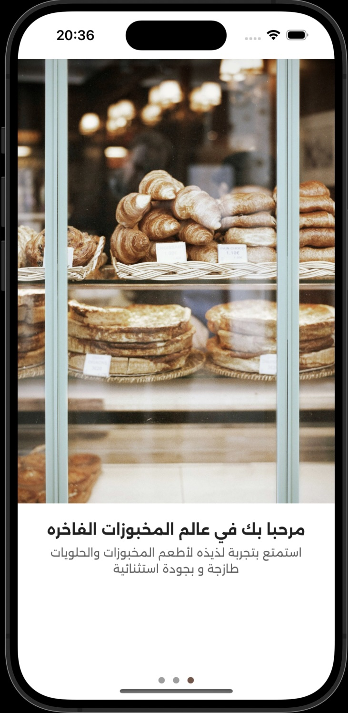
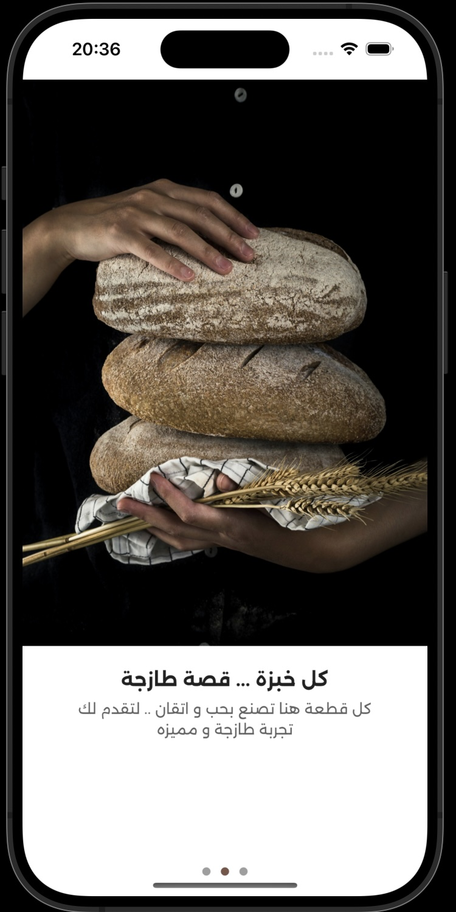
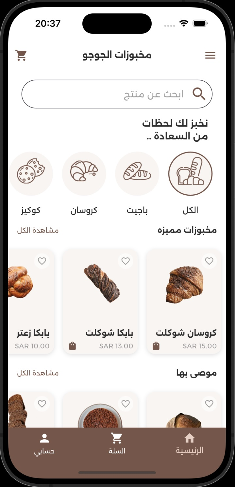
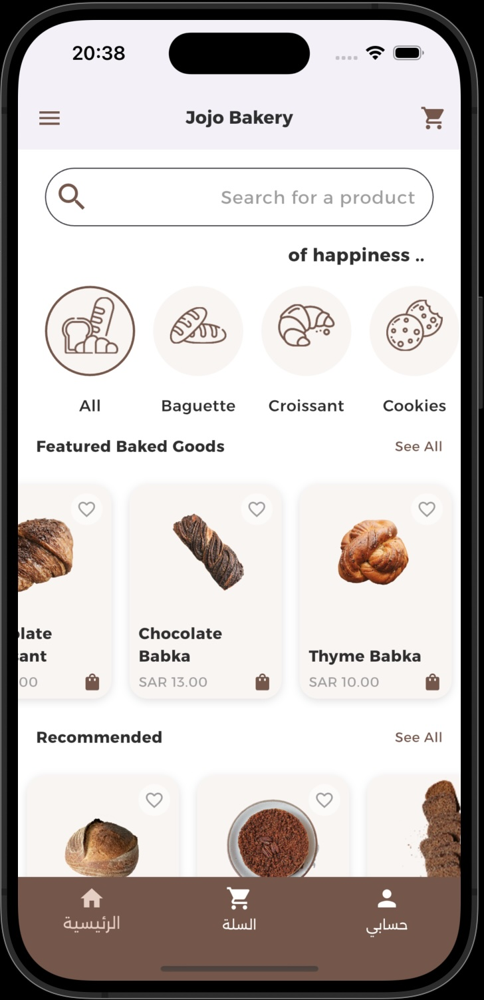
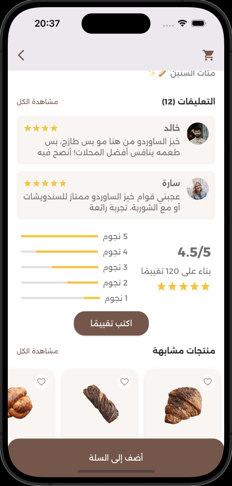
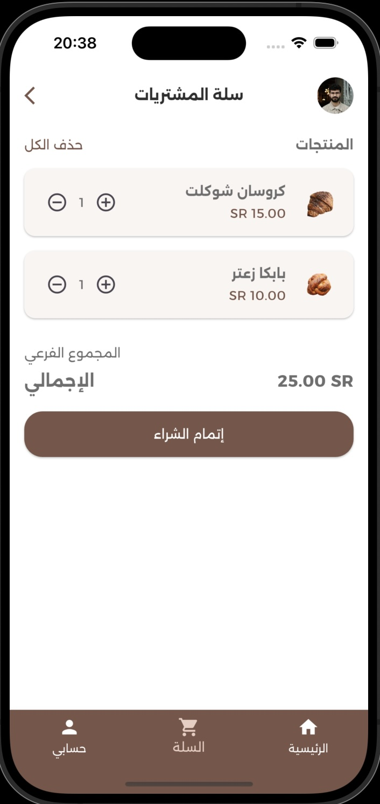
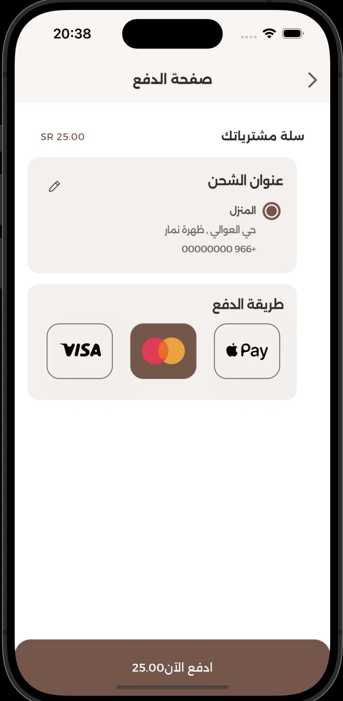
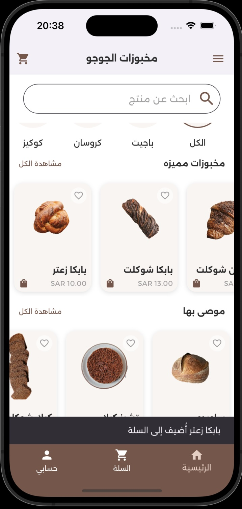
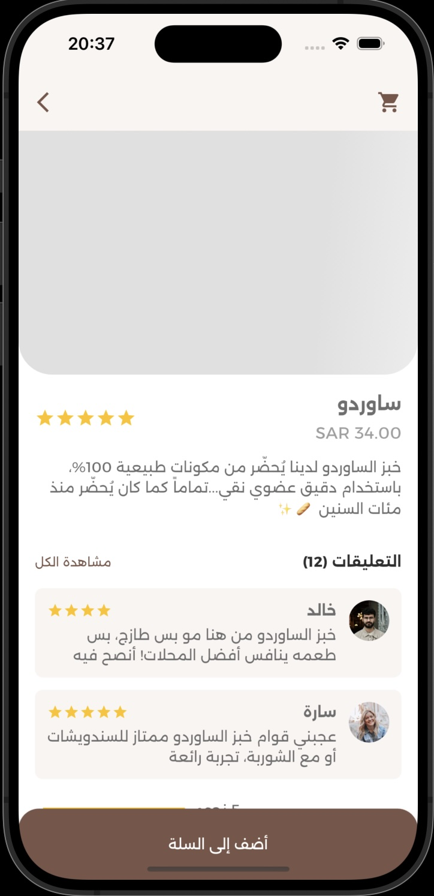

# 📱 Jojo Bakery – Flutter App

A bilingual (Arabic / English) café & bakery application that lets users browse fresh products, add them to the cart, and track their order with delightful animations and shimmering placeholders.

---

## 📸 Screenshots / Demo

| لقطة | الوصف |
|------|-------|
|             | Splash |
|    | On‑Boarding 1 |
|    | On‑Boarding 2 |
|            | الصفحة الرئيسـيّة (عربي) |
|            | Home (English) |
|    | Product Details |
|           | Cart |
|           | Payment |
|   | Bottom Sheet |
|        | Shimmer Loading |


---

## ✨ Features
- **Multi‑language** (localization via *easy_localization*).
- **Splash Screen & On‑Boarding (PageView)**.
- **Drawer** للتنقّل بين الأقسام.
- **Bottom Navigation Bar** رئيسي.
- **Shimmer Effect** أثناء التحميل.
- **Tabbed menu** (TabBar / TabBarView).
- **Bottom Sheet** لخيارات إضافية.
- **Add to Cart + Cart management** مع تنبيه *SnackBar*.
- **Form Validation** (تسجيل دخول / إنشاء حساب).
- **Light & Dark Themes**.

---

## 🛠 Tech Stack

* **Flutter** (3.x, Dart 3)
* **State Management:** setState (small app)
* **Localization:** [`easy_localization`](https://pub.dev/packages/easy_localization)
* **Animations / UI Enhancers:**  
  * [`shimmer`](https://pub.dev/packages/shimmer) – loading placeholders  
  * [`animated_text_kit`](https://pub.dev/packages/animated_text_kit) – order processing texts  
  * [`font_awesome_flutter`](https://pub.dev/packages/font_awesome_flutter) – social icons

---

## 🚀 Installation

```bash
# 1. استنساخ المستودع
git clone https://github.com/⟪username⟫/⟪repo⟫.git
cd ⟪repo⟫

# 2. تثبيت الاعتماديات
flutter pub get

# 3. تشغيل التطبيق
flutter run

## 📂 Folder Structure 

lib/
 ├─ models/          # صنف Product, CartItem …
 ├─ controller/      # CartController, LocalizationController …
 ├─ screens/         # home_screen.dart, cart_screen.dart, ...
 ├─ widgets/         # reusable widgets (ProductCard, CustomButton …)
 ├─ theme/           # app_colors.dart, app_theme.dart
 ├─ localization/   
 ├─ main.dart
 assets/
 └─ translations/    # ar-SA.json, en-US.json
 └─ icons/
 └─ images/
 └─ fonts/

🙋‍♀️ Author
Your Name
GitHub · LinkedIn

